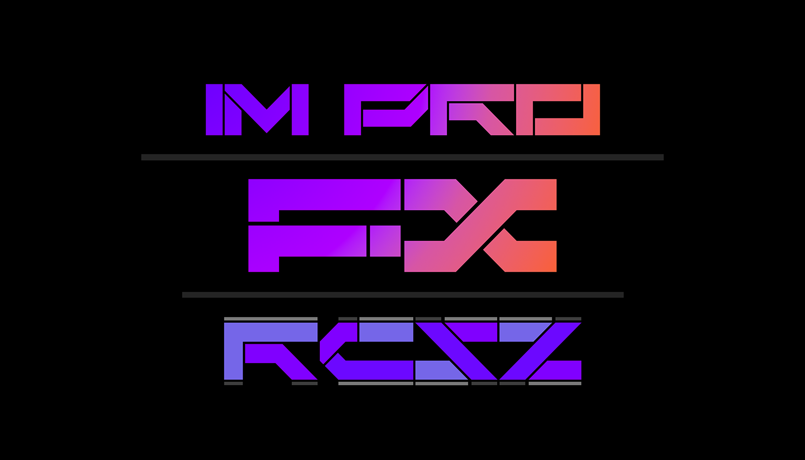

# ImProFX
基于ImGui的OpenGL着色器视觉特效GUI框架
> Version 1.0.0 2023_11_02 RCSZ.

预告: 最近会更新1.1.0, 2023除夕晚跨年发布2.0.0版本, 视觉效果以及框架使用将会有空前的提升!

项目全称 ImGui ProFX 使用OpenGL着色器的特效来加强ImGui界面的视觉效果, 以及加入了部分插值动画, 只不过这可能只适用于设备较好的用户.

还是做到了尽量简单化, 着色器资源, 贴图纹理资源, 动画对象资源~一般情况下~都能自动回收, 不需要关心GLFW窗口创建以及配置ImGui等.
> - 此坑肯定咬牙填(不扔了) /滑稽

  
  

### 以下核心部分文档
- [ShaderFX文档](docs/improfx_shaderfx.md)
- [ImGuiPro文档](docs/improfx_imguipro.md)
- [Animation文档](docs/improfx_animation.md)

### VisualStudio2022项目
开袋即食~
- vs2022_sln_package/imgui-profx-vs2022_demo.zip 带Demo的项目(如上图)
- vs2022_sln_package/imgui-profx-vs2022_src.zip 纯净框架项目(无丝竹之乱耳 /滑稽)

> 框架的逻辑编写在 "imgui_profx_logic\framework_sys.cpp" 中有 Init,Loop,Free 三个基本函数

第三方依赖库:
- OpenGL GLFW3
- OpenGL GLEW
- ImGui
- RapidJSON

2023-11-02 (1)
| 总行数: | 测试设备(GPU) | IDE |
| :---: | :---: | :---: |
| 2981 | RTX4060 Labtop | VisualStudio2022 |

（我菜佬勿喷
