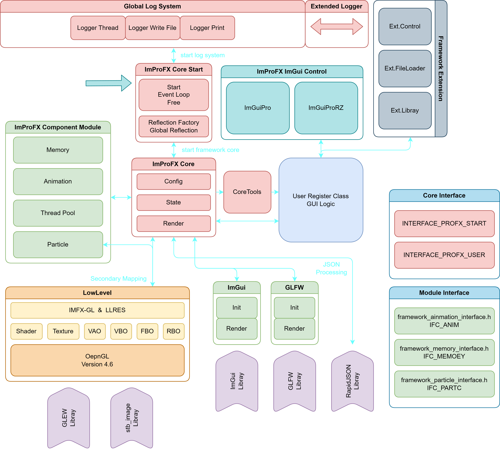
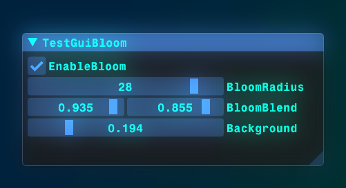

# ImProFX
__当前开发路线全部为早期实践版(更新速度非常快),__ __也希望你能友好的提出建议,__ __我也是在学习中摸索.__

基于ImGui和OpenGL着色器来优化原版ImGui视觉效果的 __桌面GUI开发轻量级框架__.
正式发行版预计: __2025 - 2026__

> - 爱发电: https://afdian.net/a/rcszvs
> - BiliBili: https://space.bilibili.com/475659860
> - 图形学QQ交流闲聊群: 862410678

__当前版本:__ __V2.1.0ALPHA__
__建议配置:__ __RTX3050__ __I5-10400__ __及以上__

- __好用的无依赖(框架)ImGui控件:__ [ImProFXcontrol](https://github.com/rcszc/ImProFXcontrol)
> 这些控件是和框架同步开发的, 但是无需依赖框架, 可以直接集成到自己的ImGui项目中 ~

---

### 请注意当前"ImFX"是一个特殊的版本,由于刚进行渲染抽象层重构非常"乱"所以没有文档

---

__版本说明:__ 小版本(.x.x)主要进行模块优化&修改, 大版本(x.)架构会有大的更改或者推翻重写.

- __公告:__ 2.2.0 IMFX 更新, LLRES 所有资源访问加锁, 抽象层需要进一步完善.
- __新增:__ 渲染抽象层 IMFX-GL
- __当前:__ 完善渲染抽象层, 完善LLRES(底层资源管理模块).
> 具体参见Demo和文档, 预计2.2.0 ALPHA在2024年1~2月更新.

---

- __下一次大更新:__ 3.0.0 ALPHA 渲染抽象层(ImFX-GL), GUI控件封装
> 预计: 2024年5月~9月 架构: IMPROFX-PM-IMFXGL 架构图会在这之前公布...

历史 2024-01-01 (7):
| Time | Version | Lines | Architecture | Graphical | Developers |
| :---: | :---: | :---: | :---: | :---: | :---: |
| 2023.11.02 | v1.0.0 Alpha | 2981 | IMPROFX-EA-OGL | OpenGL4.6 | RCSZ |
| 2023.11.06 | v1.1.0 Alpha | 3347 | IMPROFX-EA-OGL | OpenGL4.6 | RCSZ |
| 2023.11.21 | v2.0.0 Test-1 | 4857 | IMPROFX-ST-OGL | OpenGL4.6 | RCSZ |
| 2023.12.05 | v2.0.0 Test-2 | 6057 | IMPROFX-ST-OGL | OpenGL4.6 | RCSZ |
| 2023.12.08 | v2.0.0 Alpha | 7002 | IMPROFX-ST-OGL | OpenGL4.6 | RCSZ |
| 2023.12.16 | v2.1.0 Alpha | 7767 | IMPROFX-ST-OGL | OpenGL4.6 | RCSZ |
| 2024.01.01 | v2.2.0 *ImFX | 9425 | IMPROFX-ST-IMFXGL | OpenGL4.6 | RCSZ | 

---
> 今年可能会有一些朋友加入开发, 争取release 1.0版本总体量控制在3万行以内.

__IMPROFX-ST-IMFX(架构)__

  

### ~~以下框架文档~~

### VisualStudio2022项目
开袋即食 /doge
- imgui-profx-vs2022.zip

__第三方依赖:__
- OpenGL GLFW3
- OpenGL GLEW
- ImGui
- RapidJSON
- STB_IMAGE
- ImGui第三方控件 (具体见第三方许可证)

> 开发测试设备: __CPU:__ I7-13700HX, E5-2683v3(*2) __GPU:__ RTX4060LabTop

> __PS:__ QT以及一些其他的桌面GUI库的历史包袱太重了(个人观点), 趁着这几年在学校时间多学习开发一个自用桌面GUI框架, 构思整个框架体系大概几周吧, 然后1.0-2.0版本重写了一次架构(后面还会有很多次重写), 相较于原版ImGui极大的提高了"舒适度", 再加上原生支持3D图形库, 可以提供更高抽象的着色器调用以及底层资源管理(LLRES)回收, ~~奈何我没有艺术细胞写的Demo难看死了~~, 也看到了很多dalao的渲染引擎争取以后能做底层兼容; 目前是属于塞了很多东西进去, 但是每样都是一个巨坑得慢慢填(比如着色器资源管理&反射等) /滑稽; 要说有啥意义我只能说造轮子永不过时.

---
（我菜, 佬勿喷
