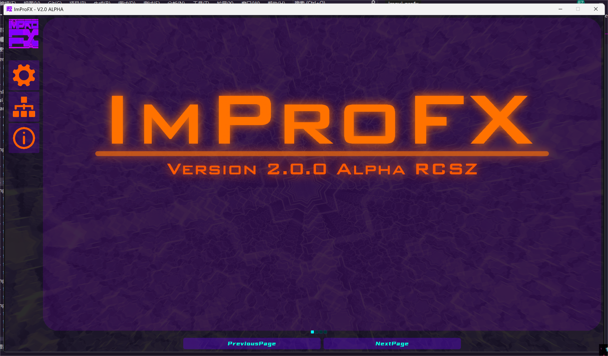
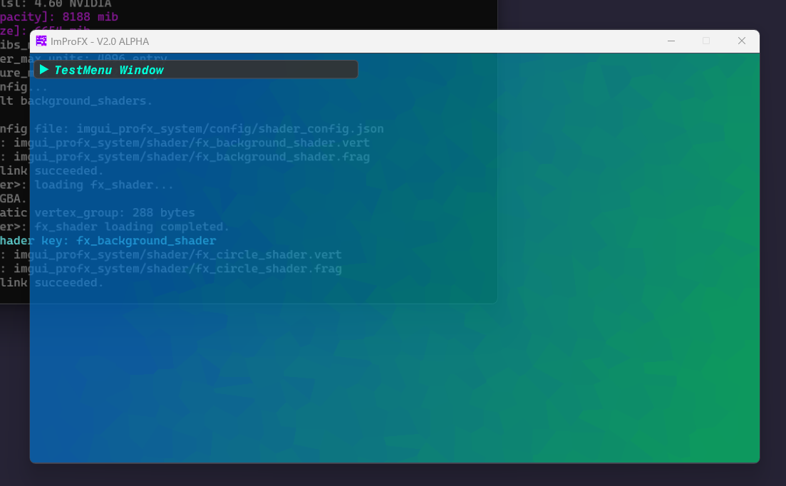

# ImProFX

基于ImGui和OpenGL着色器来优化原版ImGui视觉效果的 __桌面轻量GUI开发框架__.

> - 爱发电: https://afdian.net/a/rcszvs
> - BiliBili: https://space.bilibili.com/475659860

__当前版本:__ __V2.1.0ALPHA__
__建议配置:__ __RTX3050__ __I5-10400__ __及以上__

__说明:__ 小版本主要进行模块优化&修改, 大版本架构会有大的更改或者推翻重写, 当前开发路线全部为早期版本~

- __公告:__ 2.1.0 ALPHA 因为是早期版本, 变动会比较大并且你在源码中可能看到文档上没有的东西, 那些是正在开发的部分 /滑稽
- __新增:__ 修改了内存对象, 新增引入第三方控件扩展, 以及动画菜单扩展(非第三方)
- __当前:__ 开发重心在ImGui扩展控件以及窗口美化, 很希望你能提出一些建议, __我也是在摸索中学习__
> 具体参见Demo和文档, 预计2.2.0 ALPHA在2024年1~2月更新.

- __大版本:__ 3.0.0 ALPHA 渲染抽象层(IMFX-GL Layer), GUI控件抽象层(IMFX-UI Layer)
> 预计: 2024年5月~9月 架构: IMPROFX-PM-IMFXGL 兼容图形底层: OpenGL Vulkan 

历史 2023-12-16 (6):
| Time | Version | Lines | Architecture | Graphical | Developers |
| :---: | :---: | :---: | :---: | :---: | :---: |
| 2023.11.02 | v1.0.0 Alpha | 2981 | IMPROFX-EA-OGL | OpenGL4.6 | RCSZ |
| 2023.11.06 | v1.1.0 Alpha | 3347 | IMPROFX-EA-OGL | OpenGL4.6 | RCSZ |
| 2023.11.21 | v2.0.0 Test-1 | 4857 | IMPROFX-ST-OGL | OpenGL4.6 | RCSZ |
| 2023.12.05 | v2.0.0 Test-2 | 6057 | IMPROFX-ST-OGL | OpenGL4.6 | RCSZ |
| 2023.12.08 | v2.0.0 Alpha | 7002 | IMPROFX-ST-OGL | OpenGL4.6 | RCSZ |
| 2023.12.16 | v2.1.0 Alpha | 7767 | IMPROFX-ST-OGL | OpenGL4.6 | RCSZ |

---

__IMPROFX-ST-OGL(架构)__

  
  
  
  

### 以下核心部分文档
> 建议按照顺序阅读

- [框架使用文档](https://github.com/rcszc/ImProFX/blob/main/docs/improfx_usage.md)
- [框架核心文档](https://github.com/rcszc/ImProFX/blob/main/docs/improfx_corefx.md)
- [框架动态信息文档](https://github.com/rcszc/ImProFX/blob/main/docs/improfx_dyinfo.md)
- [框架ImGui动画控件文档](https://github.com/rcszc/ImProFX/blob/main/docs/improfx_animation.md)
- [框架ImGui扩展控件文档](https://github.com/rcszc/ImProFX/blob/main/docs/improfx_imguipro.md)
- [框架粒子系统文档](https://github.com/rcszc/ImProFX/blob/main/docs/improfx_particle.md)
- [框架内存对象文档](https://github.com/rcszc/ImProFX/blob/main/docs/improfx_memory.md)
- [框架线程池文档](https://github.com/rcszc/ImProFX/blob/main/docs/improfx_threadpool.md)
- [框架扩展模块文档](https://github.com/rcszc/ImProFX/blob/main/docs/improfx_extension.md)

### VisualStudio2022项目
开袋即食 /doge
- imgui-profx-vs2022.zip

第三方依赖:
- OpenGL GLFW3
- OpenGL GLEW
- ImGui
- RapidJSON
- stb_image
- 一些ImGui第三方控件(具体见第三方许可证)

> 开发测试设备: __CPU:__ I7-13700HX, E5-2683v3(*2) __GPU:__ RTX4060LabTop

> __PS:__ 趁着这几年在学校想开发个"像样"的东西(以后可能还有同学&朋友加入开发), 刚好以前一直在用ImGui, 结合OpenGL的着色器以及很多工具模块做一个轻量级桌面GUI开发框架, 相较于原版ImGui极大的提高了"舒适度", ~~奈何我没有艺术细胞写的Demo难看死了~~, 目前是属于塞了很多东西进去, 但是每样都是一个巨坑得慢慢填(比如内存对象&反射等) /滑稽; 编程在于多练习, 要说有啥意义我只能说造轮子永不过时.

---
（我菜佬勿喷
