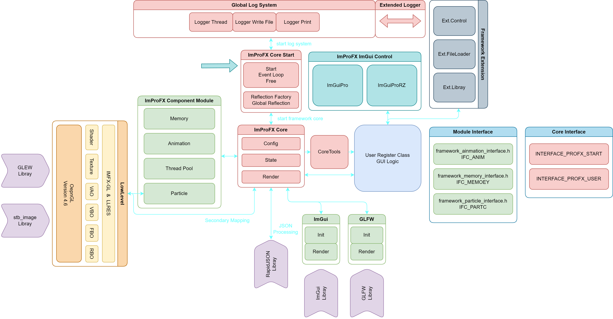
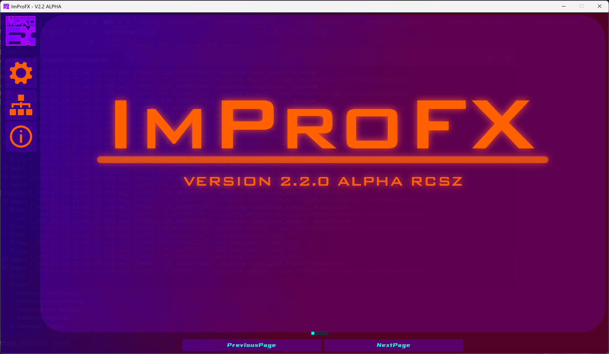

## ⚠️ 项目已废弃 ⚠️
> - 别看了, 屎一样的框架, 可以直接到结尾看吐槽...
> - 全部的代码包括重构了一半的都扔这了.
> - __请前往最新项目:__ [PSAGame2D](https://github.com/rcszc/PSAGame2D)

---

# ImProFX
基于ImGui和OpenGL着色器来优化原版ImGui视觉效果的 __桌面GUI开发轻量级框架__.
~~正式发行版预计: __2025 - 2026__~~

> - 爱发电: https://afdian.net/a/rcszvs
> - BiliBili: https://space.bilibili.com/475659860
> - 图形学QQ交流闲聊群: 862410678

__当前版本:__ __V3.0.0ALPHA__ (中断)
__建议配置:__ __RTX3050__ __I5-10400__ __及以上__

---

__版本说明:__ 小版本(.x.x)主要进行模块优化&修改, 大版本(x.)架构会有大的更改或者推翻重写.

- __公告:__ 3.0.0 ALPHA 更新, 项目荒废...
- __新增:__ -
- __当前:__ -

---

### 项目荒废为止的全部资料
> 包含源码,vs2022工程,drawio架构图等

[目录](project/)

---

| Time | Version | Lines | Architecture | Graphical | Developers |
| :---: | :---: | :---: | :---: | :---: | :---: |
| 2024.03.12 | v3.0.0 ALPHA | 9967 | IMPROFX-ST-IMFXGL | OpenGL4.6 | RCSZ | 

[框架历史](VERSION.md)

__IMPROFX-ST-IMFXGL(架构)__

  

### VisualStudio2022项目
无

__第三方依赖:__
- OpenGL GLFW3
- OpenGL GLEW
- ImGui
- RapidJSON
- STB_IMAGE 
- ImGui第三方控件 (具体见第三方许可证)

> 开发测试设备: __CPU:__ I7-13700HX, E5-2683v3(*2) __GPU:__ RTX4060LabTop

---
__PS(个人吐槽):__ 什么垃圾玩意, OpenGL底层已经写成一坨了, 但是还好的是解耦了一下, 以后项目可以直接把LLRES扣出来用~ 其他辅助模块纯粹玩具没吊用, 项目改名为屎山是如何炼成的 /滑稽 byd还是航模好玩 (bushi

---
（我菜, 佬勿喷
