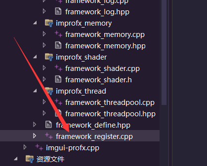
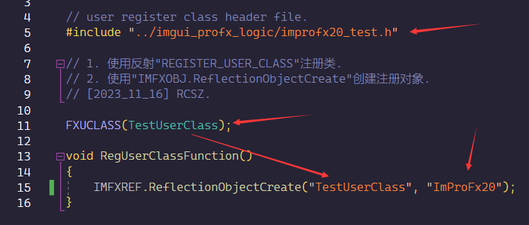
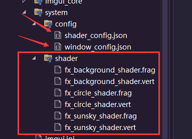
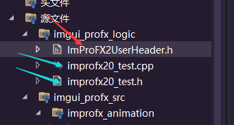

# ImProFx - UserUsage
RCSZ

>- 2023_11_21 version 2.0.0 TEST

如何快速使用框架.

## 2.0.0T
> - 首先 ImProFX 是基于 ImGui 轻量界面库和 OpenGL 着色器实现的
> - 运用 ImProFX 需要提前掌握一定的 OpenGL 图形学知识和 ImGui 的使用(C++就不用说了)

首先用户类需要继承框架的用户接口, 才能注册到框架中, 具体参见以下注释:
```cpp
// 所有用户 GUI 逻辑(关系到"EventLoop")都必须继承"INTERFACE_PROFX_USER"并注册
class INTERFACE_PROFX_USER {
public:
    // 初始化阶段(调用次数:1)
    // @param  "FrmDat" (用户类调用框架数据)
    // @return 初始化标志 (false[失败]:框架将会直接退出程序).
	virtual bool LogicInitialization(FRMCORE_PACKAGE& FrmDat) = 0;

    // 事件循环阶段(调用次数:Loop)
    // @param  "FrmDat" (用户类调用框架数据), "FrmInfo" (用户类调用框架信息[状态])
    // @return 运行标志 (false:事件循环退出框架开始释放).
	virtual bool LogicEventLoop(FRMCORE_PACKAGE& FrmDat, FRMCORE_INFO& FrmInfo) = 0;

    // 事件循环正常退出释放阶段(调用次数:1)
	virtual void LogicCloseFree() = 0;
};
```
```cpp
class UserClass :public CoreModuleIMFX::INTERFACE_PROFX_USER { ... };
```

接下来是注册步骤, 打开VisualStudio2022项目.sln文件后会, 找到注册头文件:



引入自己编写类的头文件, 然后通过宏注册已经继承接口创建好的用户类, 并且使用反射创建全局唯一对象(名称):
> "RegUserClassFunction" 为系统函数, 作用是在框架初始化阶段创建对象.



然后参考文档配置好框架配置文件以及着色器后就OK了:



---
用户编写在"imgui_profx_logic"文件夹内, "ImProFX2UserHeader.h"为框架提供的头文件, 直接同级包含即可调用框架, "improfx20_test".cpp&.h为随手写的一个很垃圾的Demo /doge.
```cpp
#include "ImProFX2UserHeader.h"
```



---

__然后就看文档使用:__

- [框架核心文档](improfx_corefx.md)
- [框架ImGui动画控件文档](improfx_animation.md)
- [框架ImGui扩展控件文档](improfx_imguipro.md)
- [框架内存对象文档](improfx_memory.md)
- [框架线程池文档](improfx_threadpool.md)
- [框架动态信息文档](improfx_dyinfo.md)

---

> 注意这是"TEST"版本属于前瞻版本, 未来可能有些内容会有变动, 而且可能会有一些Bug, 请以正式版本为准 (还在肝 /悲).

Update 20231121
