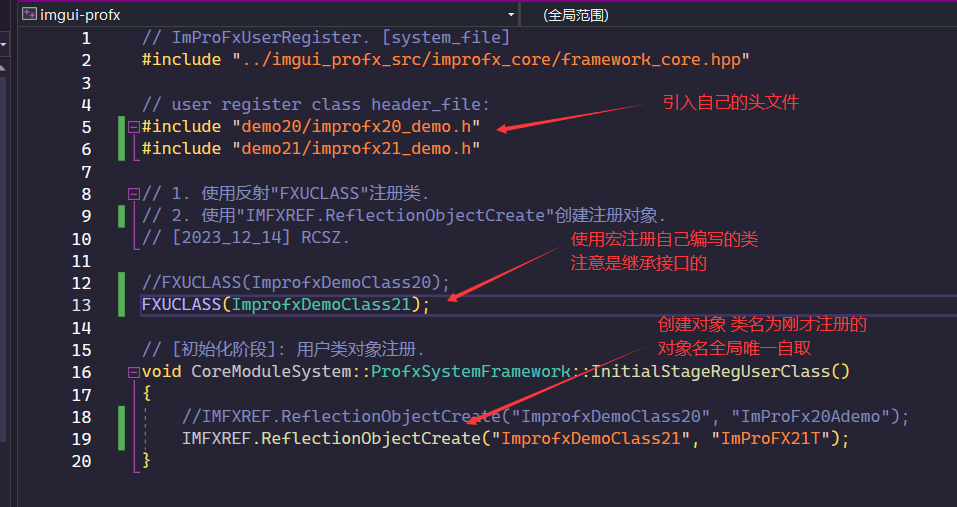

# ImProFx - UserUsage
- [x] Update.20240110 RCSZ

__前言(RCSZ):__ 
- ImProFX图形GUI框架是使用imgui与opengl图形底层结合相对高级的界面框架, 因为内部构建了图形抽象层(IMFX-GL), 所以提供了很多抽象简单的方法去调用着色器(优化界面效果), 以及内置的粒子系统, 包括资源的自动回收, 以及一些辅助工具等, 同时具有imgui的轻量和即时性.
- 一个GUI框架需要经历漫长的打磨和架构修改, 目前开发版本路线全部属于早期实践版本, 欢迎大家一起学习讨论.

## 2.2.0A
> - 首先 ImProFX 是基于 ImGui 轻量界面库和 OpenGL4.6 着色器实现的
> - 运用 ImProFX 需要提前掌握一定的 OpenGL 图形学知识和 ImGui 的使用 (C++17也需要熟练使用)

首先用户类需要继承框架的用户接口, 才能注册到框架中, 具体参见以下注释:
```cpp
// 所有用户 GUI 逻辑(关系到"EventLoop")都必须继承"INTERFACE_PROFX_USER"并注册
class INTERFACE_PROFX_USER {
public:
	// 初始化阶段(调用次数:1)
	// @param  "FrmDat" (用户类调用框架数据)
	// @return 初始化标志 (false[失败]:框架将会直接退出程序).
	virtual bool LogicInitialization(FRMCORE_PACKAGE& FrmDat) = 0;

	// 事件循环阶段(调用次数:Loop)
	// @param  "FrmDat" (用户类调用框架数据), "FrmInfo" (用户类调用框架信息[状态])
	// @return 运行标志 (false:事件循环退出框架开始释放).
	virtual bool LogicEventLoop(FRMCORE_PACKAGE& FrmDat, FRMCORE_INFO& FrmInfo) = 0;

	// 事件循环正常退出释放阶段(调用次数:1)
	virtual void LogicCloseFree() = 0;
};
```
例:
```cpp
class UserClass :public CoreModuleIMFX::INTERFACE_PROFX_USER { ... };
```

__保姆级使用教程:__
> 图片可能是以往的, 但是意思一样 /doge

接下来是注册步骤, 打开VisualStudio2022项目".sln"文件后会, 找到框架注册文件:
> 在 imgui_profx_logic 文件夹中


引入自己编写的头文件, 然后通过宏注册已经继承接口创建好的用户类, 并且使用反射创建全局唯一对象(名称):
> 注意继承 "INTERFACE_PROFX_USER"接口, 并且注册到框架中



然后参考文档配置好 框架配置文件 & 自己的着色器 后就OK了:


---

开启框架扩展: 在引入调用框架头文件之上定义宏如图(具体可以前往 imgui_profx_logic/demo_header.hpp 文件)


---

__框架全局日志系统:__
全局日志为线程安全, 文件处理为多线程异步, 框架会自动管理创建和销毁, 不需要关心后台日志处理等.
```cpp
// 日志 等级 & 控制台输出颜色:
enum LOGLABEL {
	LOG_ERR  = 1 << 1, // <错误> 红色
	LOG_WARN = 1 << 2, // <警告> 橙色
	LOG_INFO = 1 << 3, // <信息> 灰色
	LOG_TRC  = 1 << 4, // <跟踪> 青色
	LOG_PERF = 1 << 5  // <性能> 紫色
};

// OLD: 之前版本不建议使用.
// @param "Label" (日志等级[标签]) "LogStrText" (日志信息)
void LOGCONS::PushLogProcess(const LOGLABEL& Label, const string& LogStrText)

// NEW: 推荐使用, 格式化字符串用法类似"vsnprintf".
// @param "Label" (日志等级[标签]) "ModuleLabel" (当前模块标签) "LogText" (日志格式化字符串) "..." (参数)
void LOGCONS::PushLogger(const LOGLABEL& Label, const char* ModuleLabel, const char* LogText, ...);

// Demo:
int param = 5;
LOGCONS::PushLogger(LOG_WARN, "[TEST]: ", "test print log: %d", param);

// 关闭控制台打印日志(只进行后台日志文件写入)
LOGCONS::SET_PRINTLOG_STAT(false);
```
- 框架日志文件会以: 框架启动时的时间序列命名
- 框架日志文件位置: imgui_profx_system/syslog/

__向量使用:__
```cpp
// 模版向量 使用&初始化 例:
Vector2T<Type> MyVec2 = Vector2T<Type>(xxx, xxx);
Vector3T<Type> MyVec3 ...
Vector4T<Type> MyVec4 ...

// 获取数据指针:
MyVec2.data();

// 调用参数:
MyVec2.vector_x;
MyVec2.vector_y;
```
---

__然后就看文档使用:__

- [框架配置文件文档](improfx_config.md)
- [框架核心文档](improfx_corefx.md)
- [框架动态信息文档](improfx_dyinfo.md)
- [框架ImGui动画控件文档](improfx_animation.md)
- [框架ImGui扩展控件文档](improfx_imguipro.md)
- [框架粒子系统文档](improfx_particle.md)
- [框架内存对象文档](improfx_memory.md)
- [框架线程池文档](improfx_threadpool.md)
- [框架扩展模块文档](improfx_extension.md)

---

- 持续完善更新框架中...

>- 2023_11_21 version 2.0.0 Test1
>- 2023_12_02 version 2.0.0 Test2
>- 2023_12_08 version 2.0.0 Alpha
>- 2023_12_16 version 2.1.0 Alpha
>- 2023_01_10 version 2.2.0 Alpha

```END```